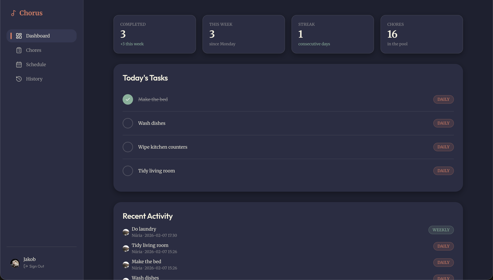

<div align="center">
  

  # Chorus

  A chore planning and tracking app for a single household, built around a cascading schedule.

  Designed for couples and small households who want chores to happen reliably without micromanaging a calendar.
</div>

<div align="center">
  
</div>

## Contents

- [Overview](#overview)
- [Key Features](#key-features)
- [Deploy Your Own](#deploy-your-own)
- [Tech Stack](#tech-stack)
- [Project Structure](#project-structure)
- [Getting Started](#getting-started)
- [Design Philosophy](#design-philosophy)
- [Contributing](#contributing)
- [License](#license)

## Overview

Chorus organizes chores by frequency (daily through yearly, with optional intermediate tiers) and uses a **cascading schedule** to keep work moving forward. The idea: each level pulls a small amount of work down from the next higher level so nothing gets forgotten.

- Each **day**: your daily chores + 1 weekly chore
- Each **week**: your weekly chores + 1 monthly chore
- Each **month**: your monthly chores + 1 yearly chore

This means 12 yearly chores naturally spread across the year (one per month), 4 monthly chores spread across the weeks, and so on. The system suggests which chore to pull in — prioritizing ones you haven't done in the longest time — but you can always override or pull in extra.

Everything ultimately lands on your **daily schedule**: you open the app, see what's on your plate today, and check things off.

**Deployment Model**: Each deployment represents a single household. All users share the same chore pool and can see each other's tasks.

## Key Features

- **Cascading planning** - Higher-frequency chores pull down into lower-frequency slots
- **Daily schedule is truth** - Everything resolves onto specific days
- **Pinned auto-planning** - Weekly/biweekly chores can be auto-placed on a preferred weekday
- **Smart suggestions** - Overdue / never-done chores are prioritized
- **Multi-user** - Assign chores and see completions per user
- **Warnings** - Pace/planning warnings when you're falling behind
- **Mobile-first UI** - Built for quick check-ins and tap targets

## Deploy Your Own

[](https://vercel.com/new/clone?repository-url=https%3A%2F%2Fgithub.com%2Floehnertz%2FChorus&root-directory=web&env=DATABASE_URL,NEON_AUTH_BASE_URL,NEON_AUTH_COOKIE_SECRET&envDescription=Database%20and%20auth%20credentials%20from%20your%20Neon%20project&envLink=https%3A%2F%2Fgithub.com%2Floehnertz%2FChorus%23deploy-your-own)

Before clicking the button, set up your backend:

1. Create a free [Neon](https://neon.tech) project
2. Enable **Neon Auth** in the project dashboard and copy the **Auth Base URL**
3. Copy the **database connection string** from the Neon dashboard
4. Generate a cookie secret: `openssl rand -base64 32`
5. Click the deploy button above and paste the three values when prompted

**Optional post-deploy setup:**

- **Web push notifications** — generate VAPID keys (`npx web-push generate-vapid-keys`) and add `NEXT_PUBLIC_VAPID_PUBLIC_KEY` / `VAPID_PRIVATE_KEY`
- **Cron secret** — set `CHORUS_CRON_SECRET` to protect the `/api/cron/autoschedule` endpoint
- **Rate limiting** — provision an [Upstash Redis](https://upstash.com) instance and add `UPSTASH_REDIS_REST_URL` / `UPSTASH_REDIS_REST_TOKEN`

## Tech Stack

- **Framework**: Next.js (App Router)
- **Database**: PostgreSQL (Neon)
- **ORM**: Prisma
- **Authentication**: Neon Auth (built on Better Auth)
- **Styling**: TailwindCSS + custom CSS variables
- **Animation**: Framer Motion
- **Testing**: Jest + React Testing Library
- **Deployment**: Vercel

## Project Structure

The Next.js application lives in the `web/` directory:

```
chorus/                  # Repository root
├── web/                # Next.js application (work here!)
│   ├── app/           # Next.js App Router pages
│   ├── components/    # React components
│   ├── lib/           # Utilities and shared logic
│   ├── prisma/        # Database schema
│   └── ...
├── CLAUDE.md          # Development documentation
├── PLAN.md            # Implementation roadmap
└── README.md          # This file
```

**All development work happens in the `web/` directory.**

## Getting Started

### Prerequisites

- Node.js 18+ and npm
- Neon account (for database and auth)
- Vercel CLI (optional, for environment sync)

### Development Setup

```bash
# (Optional) Link to Vercel project (for env sync)
# Run from the repository root (the Vercel project Root Directory is `web`)
vercel link
vercel env pull web/.env.development.local

# Now do all app/dev work in the web directory
cd web

# Install dependencies
npm install

# Or manually set up environment variables
cp .env .env.local
# Edit .env.local with your database and auth credentials

# Set up database and run migrations
npx prisma migrate dev

# Start development server
npm run dev
```

Visit `http://localhost:3001` to see the app.

### Environment Variables

Required (see `web/.env.example`):

- `DATABASE_URL`: Postgres connection string
- `NEON_AUTH_BASE_URL`: Neon Auth base URL
- `NEON_AUTH_COOKIE_SECRET`: cookie secret

Optional (debug/perf knobs; defaults are off):

- `CHORUS_PROFILE=1`: logs coarse timings for auth + autoscheduling
- `PRISMA_LOG_QUERIES=1`: Prisma query logging (stdout)
- `PRISMA_PROFILE_QUERIES=1`: logs query durations (stdout)
- `PRISMA_SLOW_QUERY_MS=50`: logs only queries slower than N ms (implies profiling)
- `NEXT_PUBLIC_NAV_PREFETCH=1`: enables Next.js Link prefetch in primary nav
- `CHORUS_ASYNC_AUTOSCHEDULE=1`: schedule view runs auto-scheduling best-effort (non-blocking)

Cron (optional):

- `CHORUS_CRON_SECRET`: enables `/api/cron/autoschedule` (authorize with `Authorization: Bearer <secret>` or `x-chorus-cron-secret: <secret>`)

### Common Commands

**Run all commands from the `web/` directory:**

```bash
cd web  # Always navigate here first!

# Development
npm run dev              # Start development server (port 3001)
npm run build            # Build for production
npm run lint             # Run ESLint
npm run test             # Run unit tests
npm run type-check       # Run TypeScript checks

# Pre-commit workflow (ALWAYS run before committing)
npm run lint && npm run test && npm run build

# Database
npx prisma migrate dev   # Create and apply migrations
npx prisma studio        # Open Prisma Studio GUI
npx prisma generate      # Regenerate Prisma Client
```

## Design Philosophy

**"Domestic Futurism"** - A refined, slightly retro-futuristic aesthetic that elevates the mundane task of chores.

- **Colors**: Terracotta (#E07A5F), Sage (#81B29A), Cream (#F4F1DE), Charcoal (#3D405B)
- **Typography**: Outfit (display) + Merriweather (body)
- **Interactions**: Smooth animations, satisfying completion effects

## Contributing

This is a personal project, but feedback and suggestions are welcome! Please open an issue to discuss any ideas.

## License

See [LICENSE](./LICENSE) file for details.
